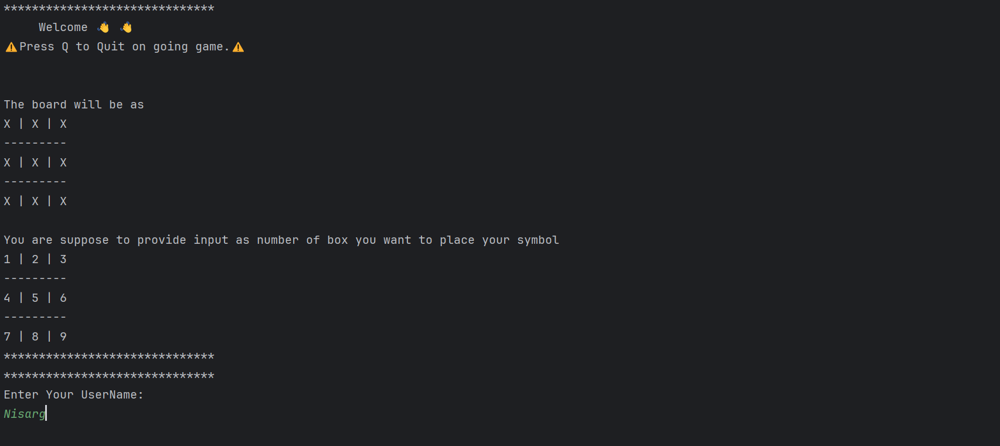
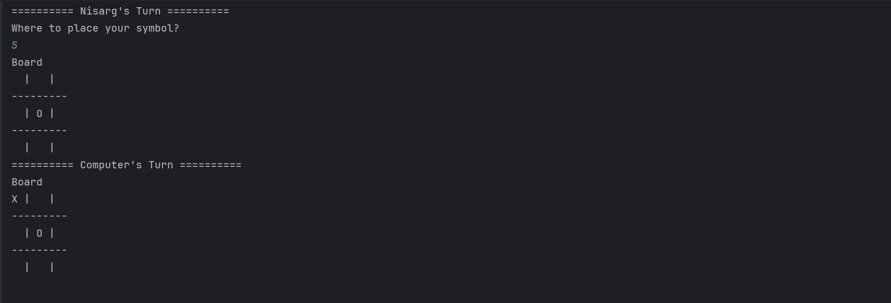
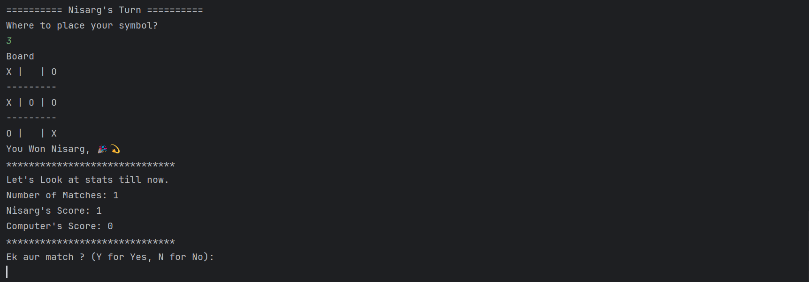

# TicTacToe Game 🎲 Implementation details

## Interface

- ### Game2Player
  - Interface for playing 2 player games.
  - Inherited by `TicTacToe` class
  - #### Methods
    - play()
    - quit()
    - userMove()
    - askForRematch()
    - printStatus()
    - printInstructions()

## Class

- ###  Class Variables
    - userName 
    - userSym -> To store user's symbol
    - computerSym
    - winningSym -> Which symbol is winner
    - currentUserScore -> to store number of games won by user
    - currentComputerScore 
    - numberOfRematch 
    - boardSize
    - board -> 2D array to visualize moves
    - X, O -> Integer variable to keep track of number of moves made
    - Scanner Object -> to take input in all the methods
    - EmptyCells -> set of integers between 1 to 9, randomly
    - playGame -> boolean variable indicating that should continue playing game or not
- ### Methods
  - initEmptyCells() 
    - Initialize emptyCells set
    - Initialize winningSym variable to `space(' ')`
    - Initialize `board`
  - printInstructions()
    - Prints `welcome` message
    - Prints general instruction to play game
    - Get input of `userName` and `userSym`
    - Calls `getSymFromUser` 
    - Calls `printDetails`
  - printDetails()
    - Print details received from user.
  - getSymFromUser()
    - Get `userSym` as cli input and validate it.
  - getInputFromUser()
    - Takes input as cell number
    - validates it and call `getRowAndColFromIdx`
    - returns index of 2D array
  - getComputerInput()
    - Gets element from `emptyCell` set
    - Convert it to 2D array Index by calling `getRowAndColFromIdx`
    - Return this 2D array Index to caller
  - checkCollision()
    - Checks if cell where user wants to place his or her symbol is filled or not
  - isGameOver()
    - Calls `checkDiagonal`, `checkHorizontal`, `checkVertical` to check if any winning combination is made or not. 
    - returns false if no user is winning
  - userMove()
    - Place symbol on the board
  - Play()
    - Calls `getInputFromUser`, `getComputerInput`
    - Calls `userMove` for both above methods
    - Calls `printStatus` 
    - Calls `AskForRematch` at end of one match
  - askForRematch()
    - Ask user if he/she wants to have rematch or not
    - Calls `printStats`, `getSymFromUser` and `initEmptyCells` if user wants to have rematch
  - printStatus()
    - Print current state of board
  - printStats()
    - Print game stats i.e. number of matches played, UserScore, ComputerScore
  - quit()
    - Close Scanner i/p stream
    - Prints termination message
    - Call exit(0)

---
# Game Play

